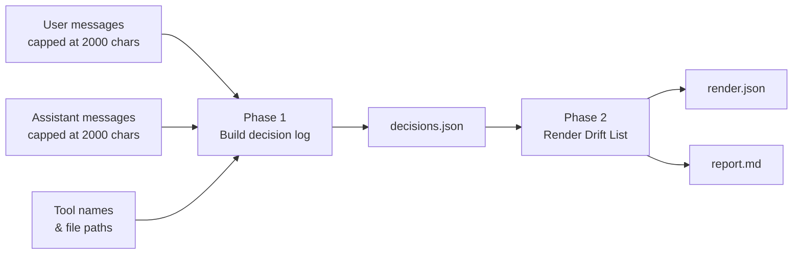

# Drift List

**Claude writes the code. Drift List tells you which engineering judgments you stopped making.**

It reads your Claude Code session transcripts and surfaces the decisions that got made without you weighing them.

<!-- TODO: animated GIF here.
     Narrative: Claude Code finishes a task, tests passing -> nudge appears ->
     brief thinking beat -> Drift List item referencing the code just written ->
     "dive in" call to action. -->

## Privacy

Nothing leaves your machine that wasn't already sent to or received from Claude Code.

**What Drift List sends**
- Excerpts from your local Claude Code session logs:
  - Timestamps
  - Your messages (first 2,000 characters of each)
  - Claude's replies (first 2,000 characters of each)
  - Claude's tool calls: tool name plus the file path, or the first 120 characters of a shell command or search pattern
- A fixed analysis prompt ([phase1-decisions.md](./src/v6/prompts/phase1-decisions.md)), and in a second call, the decisions found in the first along with a report-generating prompt ([phase2-render.md)](src/v6/prompts/phase2-render.md).

**Where it goes**
- Only to the endpoint you configure with `ANTHROPIC_BASE_URL`, the same one Claude Code uses.
- No telemetry, analytics, or other network calls.

**What it never touches**
- File contents, tool results, bash output, or thinking text from your logs.
- Your project files. It reads the session logs only.
- Your logs or code. It writes only to its output directory.
- Session IDs and working-directory paths stay local.


## Quick Start

Requires Node 22 or greater. Set your credentials, then run:

```sh
export ANTHROPIC_AUTH_TOKEN="your-token"
# or: export ANTHROPIC_API_KEY="sk-ant-..."
npx github:facultymatt/drift-list --hours 1
```

Report appears in `~/.drift-list/runs/<timestamp>/report.md`.

Using a corporate gateway such as AskSage? Add one more line before running:

```sh
export ANTHROPIC_BASE_URL="https://your-gateway/anthropic"
```

## Why

The goal is to keep two things: fluency in the craft, and the judgment that makes an engineer good at directing a model. They are not separate concerns — losing craft erodes the ability to make good judgment calls. Let it go far enough and the model stops being a tool you direct and becomes a crutch you lean on.

In Anthropic's [Public Record survey][record] of ~52,000 Americans, cognitive dependency ranked as the second most common fear at 56%, behind only job loss. Their [education research][education] put it plainly: AI may act as a crutch, "stifling the development of foundational skills needed to support higher-order thinking."

- **Junior engineers** may never build the judgment that makes senior engineers effective at directing a model.
- **Senior engineers** may quietly lose it, one delegated decision at a time, while their output goes up.

Neither of these shows up in your commit history, but both can be reasoned from your Claude Code transcripts.

## What it does

Point it at a time range. It reads the Claude Code session logs in `~/.claude`, builds a decision log of what got decided and by whom, and renders your Drift List.



<!-- _Dashed nodes and arrows: planned for future versions._ -->

Every item names a decision Claude made, who drove it, whether you engaged, and what skill sits behind it — plus a concrete exercise where one is worth doing. Here is an example from a run building a React web application with a countdown timer.

> ### Drift List Report
>
> **The countdown runs on `setInterval`.** Whether the timer slips over a long run, and whether `setTimeout` recursion or `requestAnimationFrame` would behave differently, never came up.
>
> **kind:** pattern<br />
> **driver:** claude<br />
> **engagement:** none<br />
> **concepts:** timer, async-scheduling
>
> **Why it matters:** Slippage is invisible on short runs and obvious on long ones; knowing when precision matters prevents user-visible inaccuracy.
>
> **Evidence:** Claude noted 'setInterval-based with clean teardown' in its session summary.
>
> **Exercise:** Write two countdown timers: one with setInterval decrementing every 1000ms, one with setTimeout recursion calculating elapsed time from Date.now(). Run both for 60 seconds. Log the final displayed time for each. Which slipped?

It also generates architectural questions. From a different run, on a small tree-search utility:

> ### Drift List Architecture Question
>
> Where should input validation live in a reusable library? If the function throws on null input, every caller has to guard. If it returns an empty array instead, a typo at the call site goes unnoticed. What's your heuristic for when to throw and when to coerce?

The distinction is deliberate: **techniques with a shape to rehearse become exercises; judgment calls become conversations.**

<!-- TODO: stills of the dive-in surfaces (code view, conversation view) -->

## What it is not

- Not a linter. It has no opinion on whether the code is good.
- Not a judgment of Claude. Claude making a sound decision unprompted is still a rep you did not take.
- Not a productivity tracker. Volume of delegation is not the signal; *unexamined* delegation is.

## Usage

```sh
# analyse the last two hours
npx github:facultymatt/drift-list --hours 2

# or an explicit window
npx github:facultymatt/drift-list --start 2026-09-05T04:45:00Z --end 2026-09-05T04:55:00Z

# or output to a specific directory
npx github:facultymatt/drift-list --hours 2 --output ./somewhere
```

Working from a clone? Use `npm run drift-list --` in place of `npx github:facultymatt/drift-list`.

Reports are written to `~/.drift-list/runs/<timestamp>/`, containing `decisions.json` (the decision log), `render.json` (the Drift List) and `report.md` (the readable version).

<!-- Runs are flat rather than grouped by project. The project a run covers is recorded in the `run` block inside the artifacts, which is a more reliable place to put it than a directory name derived from a path.

Reports deliberately do not live under `~/.claude`. That directory belongs to Claude Code, and anything written there can be read back into a later session — which would mean Claude eventually reading its own assessment of how much you delegated. -->

A few things to know when reading your first report:

- Smaller windows work better, but too small a window may misattribute work or produce lower quality output.
- Concept labels currently skew towards React/TS/Full Stack.
- Most heavily tested on React/TS/Python/RabbitMQ/Postgres full-stack and Docker/Helm infrastructure work.
- Reports on sessions heavy with subagents, document generation, or non-coding work have not been fully tested.

## Setup

Drift List uses the same environment variables as Claude Code, so if you have already configured Claude Code for a custom endpoint, it should work with no further setup.

| Variable | Purpose |
| --- | --- |
| `ANTHROPIC_AUTH_TOKEN` | Bearer token for gateways that issue their own credentials, such as AskSage. Checked first. |
| `ANTHROPIC_API_KEY` | Your Anthropic API key. Used if no auth token is set. |
| `ANTHROPIC_BASE_URL` | Point requests at a gateway or proxy instead of Anthropic directly. |
### Where to put credentials

In order of preference:

1. **Exported from your shell profile.** Put the exports in `~/.zshrc` or `~/.bashrc`. Works everywhere, including `npx`.
2. **A `.env` file** in the project root, for local development against a clone.
3. **A credential helper.** If you have `apiKeyHelper` configured in `~/.claude/settings.json`, support for it is planned but not yet implemented.

**Do not put the key inline on the command line.** `ANTHROPIC_API_KEY=sk-... npx ...` writes your key into shell history and exposes it in `ps` output to anything running as your user. Export it or use a helper.

## Model and token usage

Drift List makes two model calls per run: one to build the decision log, one to render the Drift List.

- **Phase 1 (decision log):** `claude-sonnet-4-5-20250929`, `max_tokens` 8192. Input scales with the size of the window you select.
- **Phase 2 (render):** `claude-sonnet-4-5-20250929`, `max_tokens` 8192. Input is the decision log rather than the transcript, so it stays roughly constant.

That should be enough to estimate spend against [Anthropic's current rates](https://www.anthropic.com/pricing). Rates are not reproduced here because they change.

## Status

**Where this is going:** an editor extension that watches your Claude Code activity and intervenes at the right moment — a nudge after a long stretch of delegation, a short exercise drawn from the code Claude just wrote, an architectural question about the thing that just got automated.

Getting a model to reliably distinguish "the engineer decided this" from "Claude decided this and the engineer said ok" is the core challenge — it fails in interesting ways and can't be verified by unit tests. Most of the work so far has been in the prompts, the schema, and evaluation: six versions of the analyzer, each tested against a handful of real sessions, quality assessed by hand and with Claude's help comparing reports across iterations. What makes scaling that possible is a proper eval harness — a set of real session logs from diverse projects, runnable against any version of the analyzer to measure whether a prompt change is actually an improvement. That's the next priority.

Working: the two-phase analysis pipeline, the Drift List, exercises and architectural questions, a concept taxonomy for cross-run matching, and the eval suite.

Not built yet: the editor extension, the intervention layer, dive-in surfaces, persistent Drift List history and recurrence detection.

## Contribute

- **Try it and share feedback.** Open a discussion or issue on Github — what resonated, what missed, what felt off. Every report is a data point.
- **Run it on your own sessions and share results.** Because transcripts can contain sensitive context, I haven't worked out a full workflow for sharing logs and eval results in source control yet. If you want to contribute eval data, reach out and we can coordinate something.
- **Help expand concept coverage.** The current taxonomy skews toward React/TS/Full Stack. If you work in Go, Rust, Python infrastructure, or anything outside that range, your sessions would be especially useful for broadening what the analyzer recognizes.

### Changesets

This project uses [Changesets](https://github.com/changesets/changesets) to manage versions and the changelog. If your PR contains a user-facing change, add a changeset:

```sh
npm run changeset
```

Pick a bump type (`patch` / `minor` / `major`) and write a short summary. Commit the generated file under `.changeset/` along with your changes. Docs-only or internal-refactor PRs can skip this (or use `npx changeset --empty` if the tooling complains).

Releases are cut by a maintainer with `npm run version` (bumps `package.json` and updates `CHANGELOG.md`) followed by `npm run release`.

## The research

Anthropic's analysis of coding usage found that
[Claude Code conversations were 79% automation, versus 49% on Claude.ai][impact], with
fully directive conversations — task completed with minimal user interaction — at 43.8%
against 27.5% in chat. The agentic surface is where delegation concentrates. And the trend
moves: by [September 2025][eci-sept], the share of directive conversations had risen from
27% to 39% in eight months, taking that share from task iteration and learning.

Engineers already feel this. In Anthropic's [first Public Record survey][record] of ~52,000
Americans, cognitive dependency ranked as the second most common fear at 56%, behind only
job loss. Their qualitative study of 81,000 Claude users found it as a tension inside the
same person: those who valued AI most for learning were roughly three times more likely to
also worry about cognitive atrophy. Anthropic's [education research][education] put the
concern plainly — that AI may act as a crutch, "stifling the development of foundational
skills needed to support higher-order thinking."

[impact]: https://www.anthropic.com/research/impact-software-development
[eci-sept]: https://www.anthropic.com/research/anthropic-economic-index-september-2025-report
[record]: https://www.anthropic.com/news/anthropic-public-record
[education]: https://www.anthropic.com/news/anthropic-education-report-how-university-students-use-claude


<!-- markco-comments
{
  "version": 2,
  "comments": [
    {
      "id": "43058dc2-479f-4488-8737-a0cca3f8c359",
      "anchor": {
        "text": "Requires Node 22",
        "startLine": 37,
        "startChar": 0,
        "endLine": 37,
        "endChar": 16
      },
      "content": "Or greater",
      "author": "Matt Miller",
      "createdAt": "2026-09-08T22:21:09.620Z",
      "orphaned": false
    },
    {
      "id": "6effdf07-bed3-485c-86b8-bff9e9cccf27",
      "anchor": {
        "text": "If you no longer remember how `setInterval` drift works, you will not weigh it against `setTimeout` recursion — not because you considered it and declined, but because it never surfaced as an option.",
        "startLine": 36,
        "startChar": 215,
        "endLine": 36,
        "endChar": 414
      },
      "content": "I don't love this example, and I wonder if an example is needed at all.",
      "author": "Matt Miller",
      "createdAt": "2026-09-08T22:21:35.515Z",
      "orphaned": true
    },
    {
      "id": "038cae3f-7276-4406-8ed7-a8f24b73587e",
      "anchor": {
        "text": ", and they are not the same problem:",
        "startLine": 40,
        "startChar": 26,
        "endLine": 40,
        "endChar": 62
      },
      "content": "Sounds to LLM",
      "author": "Matt Miller",
      "createdAt": "2026-09-08T22:22:06.134Z",
      "orphaned": true
    },
    {
      "id": "5caec822-4ba5-41fc-bf9c-116452754d6d",
      "anchor": {
        "text": "It does not receive file contents, thinking blocks, tool results, or bash output",
        "startLine": 66,
        "startChar": 234,
        "endLine": 66,
        "endChar": 314
      },
      "content": "Although some of these are planned.",
      "author": "Matt Miller",
      "createdAt": "2026-09-08T22:24:02.834Z",
      "orphaned": true
    },
    {
      "id": "e62ab5ed-b2ab-4388-a85d-f5dffd5b3d51",
      "anchor": {
        "text": "drift",
        "startLine": 42,
        "startChar": 23,
        "endLine": 42,
        "endChar": 28
      },
      "content": "So the use of drift here is unfortunate because I think it kind of gets modeled with the drift list name. I don't want people to think that it only deals with Timer drift. Is there a way free word what's happening here with the timer additionally down online 77 and 83 the word drift is used a second and third time.",
      "author": "Matt Miller",
      "createdAt": "2026-09-08T22:25:26.557Z",
      "orphaned": false
    },
    {
      "id": "b63f711f-4ec1-4569-85a2-ebeb688feb99",
      "anchor": {
        "text": "for the judgment calls that have no kata",
        "startLine": 85,
        "startChar": 44,
        "endLine": 85,
        "endChar": 84
      },
      "content": "I mentioning Qatar is a little out of place here cause we haven't brought that up yet. And that's not the only designation for the architecture questions is it? I guess you could look at the V6 prompt however I wonder if we could just remove the hyphenated part and leave it with it also generates architectural questions.",
      "author": "Matt Miller",
      "createdAt": "2026-09-08T22:26:21.839Z",
      "orphaned": true
    },
    {
      "id": "8014da7b-f7d7-45f7-95b4-924f61ef1f54",
      "anchor": {
        "text": "See [THESIS.md](./THESIS.md) for the full framing — what counts as a rep not taken, and the three axes it splits into (production, judgment, supervision).",
        "startLine": 99,
        "startChar": 0,
        "endLine": 99,
        "endChar": 154
      },
      "content": "I want to remove the link to thesis intentionally because it's actually a thesis Claude wrote based on Claude understanding of this project throughout my prompting with it. I haven't thoroughly reviewed it and it may or may not have some inconsistencies. I think there are kind of the three framing of what I wanted to pull out which the thesis mentioned which maybe could be highlighted here or in this dock or in the section, but it could just be cut",
      "author": "Matt Miller",
      "createdAt": "2026-09-08T22:27:33.549Z",
      "orphaned": true
    },
    {
      "id": "405166e2-e2c5-494d-a693-7f6751a2d028",
      "anchor": {
        "text": "| `MENTOR_MODEL_PHASE1` | Override the decision-log model. Optional. |\n| `MENTOR_MODEL_PHASE2` | Override the render model. Optional. |\n",
        "startLine": 142,
        "startChar": 0,
        "endLine": 144,
        "endChar": 0
      },
      "content": "So I intentionally removed the phase 1 and two model variables as I don't want users using that because it's untested so I'm wondering if I should just remove the whole set up section as I've already covered set up elsewhere in the dock",
      "author": "Matt Miller",
      "createdAt": "2026-09-08T22:30:16.055Z",
      "orphaned": true
    },
    {
      "id": "04a5fc0c-e35c-47c2-9d1d-00fc171934fe",
      "anchor": {
        "text": "```mermaid\nflowchart LR\n    A[\"Session transcripts\\n~/.claude\"] --​> B[\"Phase 1\\nBuild decision log\"]\n    B --​> C[\"decisions.json\"]\n    C --​> D[\"Phase 2\\nRender drift list\"]\n    D --​> E[\"render.json\"]\n    D --​> F[\"report.md\"]\n```",
        "startLine": 57,
        "startChar": 0,
        "endLine": 64,
        "endChar": 3
      },
      "content": "The diagram works, but it's it's a little boring. Not that I want to embellish it just for embellishment sake, but it feels like maybe this is an opportunity to show why it brings in from the transcript specifically and maybe yeah I guess that would be the only thing but maybe that's too much detail and then you know we're not showing exactly what's in render Chase on her and report.marked down one thought, though as if we do show what we already read and Claude and then show what we are considering reading in the future maybe with a different color coating or symbology then a lot of of what's in that\n\nCan go away like currently reading you know a user text blocks kept a 2000 characters assistant in text block kept 2000 characters etc. you know and then additional lead we would show the file contents thinking block to results or bash output as you know with maybe a dotted line or a yellow background and say something like being considered for a future. Can we show a legend in a mermaid diagram?",
      "author": "Matt Miller",
      "createdAt": "2026-09-08T22:32:44.926Z",
      "orphaned": true
    }
  ]
}
-->