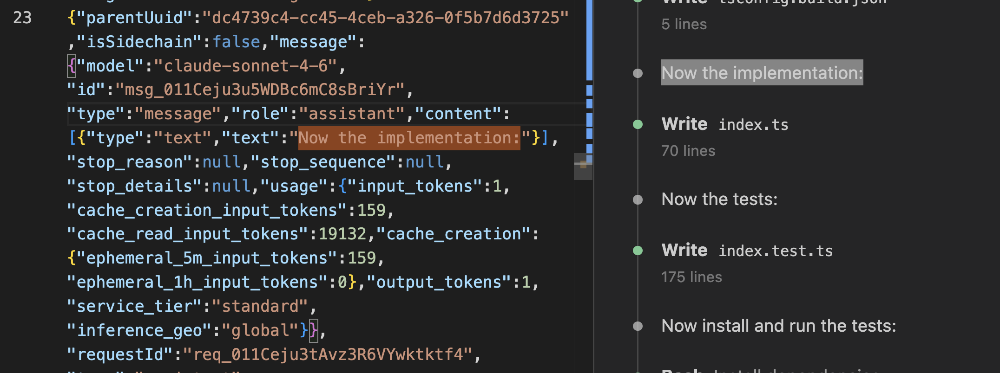
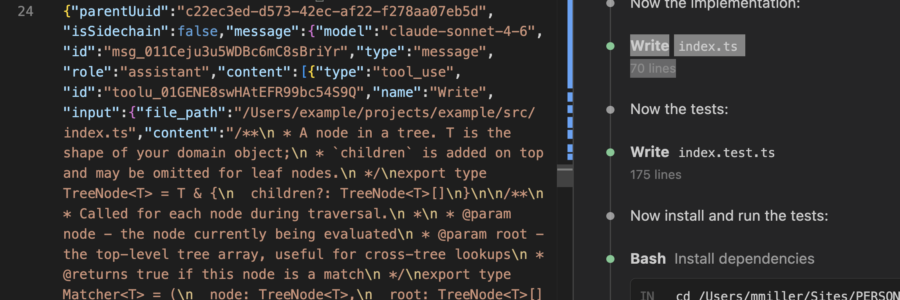
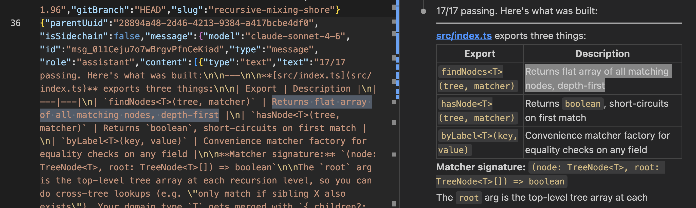

# TODO

Sources: `src/engineering-todos.md` (drift list) and `src/README.md` (open items). Overlaps are flagged inline.

> Noticed I'm using VS Code extension 2.1.96, which is about 5 months out of date. There is a chance the schema for logs has changed. Need to resolve how to store eval sets for different versions. Do I generate baseline using old version? Do I upgrade and then generate baseline evals? This should surface if any issues are present. Is there a way to get the types and or the JSON schema from the Claude Code extension itself to validate against? Look on the github project. 

---

## 0. Baseline (prerequisite for everything in §3)

The goal is to build a sample of test data from real examples projects for use in evals and testing. All logs from the sessions will be committed in this repo. Use made-up example or personal projects. 

- [ ] Establish eval directory and structure. Currently the repo has an examples dir in each version dir, for ex: `src/v6/examples/react-timer-part1`. Evals are organized in `evals/results/date`. This grew organically and now its time to create a clean organized structure. Additionally we might want a gitignore directory of evals which are not committed to source control but still useful for testing. 
  - A good format could be: 
  - `evals/react-timer/logs`
  - `evals/react-timer/reports`
  - `evals/react-timer/scores`
  - and for private evals `evals-private/...`
- [ ] Pick 5–8 windows across different project types (React, tree utility, real work session, heavy engineer engagement, none).
- [ ] Archive raw `.jsonl` for each using `./src/scripts/save_jsonl.ts`
- [ ] Small pipeline mods to support
  - [ ] command line arg for log directory
  - [ ] Dry run that prints the prompts to console only
  - [ ] record input/ output token count - I think this is already being logged just capture in the output json files.
- [ ] Write expected findings for each window before running anything.
- [ ] Run pipeline to generate report dir from v6 for each project.
- [ ] Commit all to source control

---

## 1. Correctness bugs (no A/B needed)

### 1a. Engineer-turn counting

`userTurns` counts tool_results. The react-timer window reports 15 engineer turns; it has zero.

- [ ] Count only user records with a non-empty text block.
- [ ] Audit `checkWindowHasEngineerTurns` — if it uses the same count it has been passing windows it should fail.
- [ ] Add react-timer window (`04:51:06Z → 04:57:42Z`) as a fixture.

### 1b. Promote `checkWindowHasEngineerTurns` to runtime

- [ ] Extend window start backwards until a real engineer turn is captured, or exit with a clear message. Must not produce a clean-looking report on the react-timer window.
  - Note this was raised before by Claude with the approach of logging warning and/or expanding the window. The issue with auto expanding the window is that its an unexpected behavior from the user. And the resulting reports still seemed accurate they just don't have the correct attribution, for ex: the report says the engineer didn't provide any direction because that log was T-10 minutes and you only ran the tool on T-5 minutes. 

> From Claude: **Eval gate:** given the react-timer window, the tool either widens to include the
originating prompt or exits with an explanation. It must not produce a clean-looking
report.

### 1c. Concept taxonomy leaks React tags *(overlaps README: "taxonomy is React/TS-web shaped")*

> Im not sure this is no A/B needed - it could very well affect the output if we are providing more or different taxonomy terms. As discussed in this section it would be better served to think of a scalable way to support the needs here. 

`react-performance` and `react-composition` appear on projects with no React. 

- [ ] Constrain taxonomy by detected project type, or drop `react-` prefix from concepts that are general. New taxonomy labels are additive; renaming/removing breaks existing example runs.

- Note there is eval check `checkConceptsGrounded` that now flags labels whose subject never appears in the window - but not sure how reliable or scalable this is.

- Note that in theory its safe to add more taxonomy without regressing, but not certain. For example as the taxonomy list grows it might consume many tokens and result in some other part of response degrading. Also note it's note scalable to add taxonomy from many languages and concepts. 

- Also note the original intent of the taxonomy was to be able to have predefined skills with external practice katas - for example link to Exercism or GreatFrontEnd Typescript exercises. Then surfacing a skill in a report, allowed suggesting the user try those exercises. A second use case is to show a visual list of top skills and how frequently Claude implements them. For for example if your top skills list is "Async control flow, React context, React Hooks, Typescript Classes" then you know top areas for skill drift and thus skills you should practice. 

- Also note we should try asking claude to come up with its own skills. If we save these as a list, and then provide in subsequent requests that will help keep the skills from drifting (for example returning Typescript Classes, TS Classes, TS Class, Classes across multiple sessions). In other words, if Drift List maintains a list of skills, each prompt the existing skills are passed in, and Claude is prompted to use those skills or suggest new ones, and then the new ones are stored with the full list and passed next time. There could still be an initial list of skills that map to external katas exercises.  

> From Claude: **Eval gate:** the recursive run produces no `react-*` concepts. Broader: no run produces
a concept tag for a framework absent from its dependency list.

### 1d. Parse `toolUseResult` defensively

It is sometimes a dict, sometimes a bare string, and the dict has at least three shapes.

- [ ] Type-guard before any field access. Eval gate: zero exceptions across all baseline windows.

> I have not seen any exceptions here yet - check Claude has this right before implementing.

> From Claude: **Eval gate:** extraction over all baseline windows throws zero exceptions.

---

## 2. Evidence integrity

- [ ] Add a `basis` field to each evidence entry: `quoted` / `inferred-from-prose` / `inferred-from-path`.
- [ ] Require the model to populate it in the phase 1 schema.
- [ ] Add eval check: anything tagged `quoted` must be substring-findable in the extraction input.

> Note the above sounds like a great addition. The eval check currently has to do some magic to find the quotes in the source logs, see below for details:

The evidence field currently allows paraphrase (`Claude noted '...' in the summary`), which defeats grounding. 

Suggested fix: require a verbatim span and move attribution to its own field:

```
"evidence": "Verbatim span copied from the transcript. No narration, no summary, no ellipsis",

"evidence_speaker": "engineer | claude | subagent",
```

Until then, `checkEvidenceGrounded` extracts the longest quoted span before matching (workaround in eval, not a prompt fix).

> From Claude: **Eval gate:** run against all baseline windows. Zero `quoted` entries fail the substring
check. Manually spot-check ten `inferred-*` entries and confirm the tag is right.

---

## 3. Extraction additions (one at a time, each with A/B against baseline)

### 3a. Bash stdout/stderr — highest confidence

- [ ] Include `toolUseResult.stdout` / `.stderr`, tail-truncated (~300 chars), plus the `interrupted` flag. Token cost target: under +5%.

> From Claude: **Eval gate:** on a window where a command failed, the report reflects it. Token cost under
+5%. No degradation in findings on windows where everything passed.

### 3b. Tool errors

- [ ] Include error strings from `toolUseResult` when it is a bare string. Near-zero token cost.

> From Claude: Record 12 in the timer log is 60 characters: `Error: File has not been read yet. Read it
first before writing to it.` Without it, the Write→Read→Write sequence looks like Claude
reconsidering. It was a tool constraint.

> From Claude: **Eval gate:** the timer window's `App.tsx` sequence is no longer characterized as
self-correction. Near-zero token cost.

### 3c. `structuredPatch` on `update` only

- [ ] Include `structuredPatch` for `type: 'update'`. Cap per patch; drop oversized patches rather than truncating mid-hunk. Measure token delta (expected +10–20%); require findings the baseline missed, not just differently-worded ones.

> From Claude: **Eval gate:** measure token delta on the baseline set — likely +10–20%. The A/B must show
findings that the baseline missed, not just differently-worded ones. If the only change is
prose, revert.

### 3d. Thinking blocks

- [ ] Include `type: 'thinking'` blocks in `extractAssistantText`, capped ~1500 chars.
- [ ] Consider a separate `[reasoning]` section so phase 1 can weight it differently from prose written to the engineer.
- [ ] Find or create at least two windows that actually contain thinking blocks before treating A/B results as meaningful.

> Note that in my Claude Code sessions I always see thinking stream into the tool. Maybe these are not saved? If saved what is the jsonl row shape? Claude will need help here since it has not been able to find this already. Do a short session and make sure thinking is on - a simple string match should find it. Note that newer models might have thinking disabled - does Claude Code still get access to thinking? In the Web UI its been removed :( 

**Non-goal (explicit):** Do not add full file contents. Already demonstrated unnecessary; do not revisit casually.

> What Claude means here is that I noted the results in v6 are already very good, without thinking considered, so how do we explain that?

> From Claude: **Eval gate:** find or create at least two windows that actually contain thinking blocks.
If the A/B shows no improvement there, the change is inert everywhere and can be reverted
without loss.

> From Claude: **Why it could matter when present:** rejected alternatives live in thinking. Today
"Claude weighed `useReducer` and chose `useState`" and "the option never surfaced" are
indistinguishable to phase 1 — and telling those apart is the whole thesis.

---

## 4. Hygiene

- [ ] Strip cwd prefix from paths — send once in the run block. Eval gate: findings unchanged, token count down.
- [ ] Record model and endpoint in the run block. *(overlaps README: "run block does not record model or endpoint")*
- [ ] Record token usage in the run block.
- [ ] Rename `MENTOR_MODEL_PHASE1/2` → `DRIFT_LIST_MODEL_*`, reading old names for one version.
- [ ] Implement `apiKeyHelper` or demote it in the README.

---

## 5. Architecture / pipeline

- [ ] **Chunk phase 1 by session.** One call per coherent task, merge after with evidence-quote dedup (not `id`). Positional crowding confirmed by v6b: first task in a multi-task window is compressed regardless of volume ceiling. Session boundaries are the natural unit; `--session-headers` already emits the delimiter.
  - Note this was inspired by the finding that smaller windows (like 30-60 minutes) had better results, while larger windows (like 2-4 hours) of activity has less great results. With greatness being judged subjectively based on the quality of drift list items, exercises, and architectural questions. 
- [ ] **Phase 1 volume ceiling.** Remove the 12–18 cap - it forces results on small windows and its lossy on large windows. 
  - Claude suggested replacing with "no upper limit; completeness over selectivity; re-read each session before finishing; structural decisions outrank parameter choices."
  - Note this was tested in v6b, rolled back due to results getting worse (subjectively). Pending full baseline re-run — do after baseline is established.
  - The recommended replacement for the `## Volume` section of `prompts/phase1-decisions.md`, tested but rolled back pending a full re-run of prior windows. Here is the prompt that was used.:

  ```
  ## Volume

  There is no upper limit. Record every decision you find.

  Scale with the input: a single focused task may yield a dozen entries, a window
  spanning several distinct tasks proportionally more. Do not compress a wide
  window into the same number of entries a narrow one would produce — an entry
  dropped here is lost permanently, because the next pass can only filter what you
  record.

  Prefer completeness over selectivity. The next pass decides what is worth the
  engineer's attention; you decide what happened. Never omit an entry because the
  engineer seemed to handle it well, because it seems minor next to something
  larger in the same window, or because a similar entry already exists — near
  duplicates are cheaper than gaps.

  Before finishing, re-read each session in the window separately and check that
  its distinct decisions are all present.
  ```

  If adopted, pair it with guidance that structural decisions outrank parameter choices — v6b spent its extra capacity on `60-tick-marks` and `100ms-tick-interval` - ie on less meaningful observations - like it was reaching to find something because of the prompt.
  - Note the requested item size could be calculated dynamically based on the log window size (ie: count jsonl rows, base on this number.) 
  - Ideally Claude could determine what makes the cut on its own given no upper window, but a really great prompt explaining what to include and what makes the cut will be key.


- [ ] **Tool activity as evidence.** Add explicit phase 1 prompt line: a `Write` or `Edit` to a new path is itself evidence of a structural decision. Module-boundary decisions were captured this way in one timer run but are not reliably reached for.

`custom-hook-extraction` and `sound-utility-module` — module-boundary decisions previously thought unrecordable because nothing in the conversation discusses them — were captured in one timer run by citing the file creation event: `File created at 'src/hooks/useTimer.ts'`. So the gap is narrower than the v6b notes suggest. The decision is visible in the tool call; the model just does not reliably reach for it. Worth an explicit line in the prompt that a `Write` or `Edit` to a new path is itself evidence of a structural decision.

> Note the addition of command line arg for dry run to prompt prompt rather than running it will be key here. I'm not sure exactly whats in the logs and whats getting sent. My hunch is this info is being sent. For example take this convo, I was able to find it by searching for `Now the implementation:` in the logs - line 23.

 

The next line, 24, shows the file write action with the contents visible. 



The shape is this with the content under `message.content[0].input.content`. 

```
"message":{
    "model":"claude-sonnet-4-6","id":"msg_011Ceju3u5WDBc6mC8sBriYr",
    "type":"message",
    "role":"assistant",
    "content":[{
        "type":"tool_use",
        "id":"toolu_01GENE8swHAtEFR99bc54S9Q",
        "name":"Write",
        "input":{
            "file_path":"/test-recursive-fn/src/index.ts","content":"/**
```

Finally Claude outputs a summary of what was built. 



If line 23 AND the summary are being sent - that is exactly what the prompt needs for an effective report. If only the summary or file paths are sent, that seems like missed opp although with the summary the report is effective thus far. And we can't guarantee that a summary will always be sent - some models or modes might not provide a detailed summary.


- [ ] **In the report, `related_ids` is written and never read.** Wire it into phase 2 — a reversal pair or linked cluster is a stronger watch-list candidate than an isolated entry. In other words, items that are cross linked are possibly better candidates for the report.
- [ ] **Structured output enforcement.** The `{` prefill makes JSON likely, not guaranteed. Switch to tool calling with `input_schema` so a missing required field is a hard error. Removes both the prefill and fence-stripping.
- [ ] **Retry on transient API failures.** Backoff on 429/500/502/503. Was seeing a lot of 502 calls when Ask Sage was done during dev. Easy to manually retry in dev but needs to be handled in the VS Code extension. 

---

## 6. Open items from README (not covered above)

- [ ] **Prior-item history.** Repeats are re-reported as fresh findings. Dedup and frequency-counting design exists but is unbuilt. Filter prior items locally by project and recency before sending.
- [ ] **Kata index.** Route to existing Exercism / GreatFrontEnd exercises where canonical ones exist; generate only for the long tail. Prototype with 20–40 hand-curated entries before investing in retrieval.
- [ ] **Phase 2 promotion count.** Always promotes 8 items regardless of pool size. Narrow windows produced better questions in the timer test. Selection should scale with pool.
  - Related to the size of observations. See that TODO for possible ways to scale and make this dynamic.
- [ ] **Fabricated tradeoffs.** Three confirmed instances of the model supplying reasoning the record does not contain. Costs credibility disproportionately.
  - This could be a good eval category 
  - Where are these instances - are they pre/post v6?
  - Need to confirm this still happens and was not based on accident of using wrong data or logs during development. The earlier version and examples from Claude make me think this might be the case. Original notes from Claude: ** Three instances: a v4 watch item claiming the status design encoded "two dimensions (severity and certainty)" when it encoded one; `no-error-handling-on-csv-export` asserting an absence from code the model never read; and a timer question asking when CSS Modules' build overhead outweighs the convenience, under Vite, where there is none. Each is the model supplying reasoning the record does not contain. Costs credibility disproportionately.


- [ ] **`stated_constraints` reliability.** Three timer-session runs recorded zero despite clear constraints in-session; a later session extracted two from near-identical phrasing. Reliability problem, not a definitional one.
- [ ] **CLAUDE.md / AGENTS.md constraints invisible to phase 1.** Convention files loaded as system prompt context; phase 1 sees effects, not causes. Misattributes `driver: claude` for choices the engineer made once in writing. Suggested fix: extract constraints from convention files for the cwds in the window and pass as pre-existing constraints, distinct from in-window constraints.
  - Note - not sure if these files are wanted or needed. my hunch is that anything in the Claude.md file will manifest itself in the logs related to implementing or checking those things. But it would be good to have at least 1 example for evals that is Claude.md heavy. 
  - Note "Project convention files are injected into the system prompt, not the transcript — the timer session shows ~17k cache-creation tokens on the first message, which is that context loading. Phase 1 sees the effect and never the cause." it would be interesting to explore this more. If the system prompt some initial prompt we can detect? Why is it so large? Whats in it? What context is being loaded? 
  
  This is worse than a coverage gap. If a convention file says "prefer CSS Modules, no styled-components", then Claude choosing CSS Modules is not a Claude decision — the engineer made it once, in writing. The report records `driver: claude · engagement: none`, which is exactly backwards, and the more disciplined the project conventions the more systematically wrong the driver split becomes. Confidently wrong beats silently missing as a failure mode.

  Suggested shape: extraction reads the convention files for the cwds in the window and passes them to phase 1 as *pre-existing* constraints, kept distinct from constraints stated in-window. The eval then only has to check they were carried through — no parsing prose to guess which lines are constraints, which is the same losing game the keyword list plays.

  Known complications: convention files change over time, so an old window would be read against today's version; they exist at repo, user and subdirectory levels and precedence would have to be resolved; and for work repos their contents may be more sensitive than the transcript, which is the same privacy question that killed the diffs sidecar. See `THESIS.md` — an inherited constraint is arguably its own kind of drift and does not fit cleanly in the three rep types.

- [ ] **THESIS.md reconciliation.** Phase 1 schema and phase 2 selection criteria not yet reconciled against the three rep-type model.
  - Note the thesis was something I asked CLAUDE to write based on its understanding of the tool, which may or may not be aligned with my actual vision. I has suspected Claude might be off track and based on some earlier replies and asked it to write this document. 

- [ ] **Phase 2 on cheaper model.** *(overlaps engineering-todos §5c)* `MENTOR_MODEL_PHASE2` exists but is untested. Eval gate: compare watch-list selections and exercise quality against Sonnet on the same baseline windows. 
  - In theory phase 1 (finding observations) would benefit from higher model and reporting from lower. 
  - Needs proper eval and test harness setup first to prevent regressions. 
  - Try phase 2 on Haiku - its only reading structured JSON which is (in theory) a much simpler task than phase 1 (Reading full logs) **Eval gate:** run both models on the same decision logs from the baseline set. Compare selected watch-list items and exercise quality. Keep Haiku only if the selections match on the items you'd have picked yourself.
- [ ] **Prompt caching.** System prompt and taxonomy are stable across runs; only the exchange block changes.
  - Note if taxonomy is dynamic as discussed elsewhere in this TODO list then caching would only work for system prompt.
  - Note can cached prompt be called with variables?

---

## Overlaps between source docs

| Topic | engineering-todos.md | README open items |
|---|---|---|
| Record model in run block | §4 hygiene | "run block does not record model or endpoint" |
| React taxonomy leakage | §1c | "taxonomy is React/TS-web shaped" |
| Evidence grounding | §2 (`basis` field) | "evidence field permits paraphrase" |
| Phase 2 on cheaper model | §5c | "Phase 2 could run on a cheaper model" |

---

## Suggested order

1. §1 correctness bugs — no A/B needed, just regression fixtures
2. §0 baseline — nothing else is measurable without it
3. §2 evidence integrity — biggest integrity win, zero token cost
4. §3a then §3b — cheap, always-present, high confidence
5. §4 hygiene — buys back tokens for expensive items
6. §3c — measure carefully
7. §3d, §5, §6 — as time allows


## Additional Open items from Model README not captured in the above list

- **Reasoning that happens outside Claude Code is invisible.** Discussion in the web app, in another tool, or in the engineer's head cannot be seen by either pipeline. Some apparent false positives are this, not a prompt defect. Dismissal with a reason is the only signal the tool can get about it.
  - Still open as of v3e.

- **Deferrals can surface late.** An arbitrary constant accepted in one session may only become visible when a later session trips over it. The analyzer flags the later symptom rather than the original deferral.
  - Still open as of v3e.

- **Bug entries have fallen** from 3 to 1 across versions. Giving `bug` its own header in v3b did not help. May be accurate for these windows, or may need attention.
  - Still open as of v3e — held at 1 across both v3d and v3e on the same window. May be accurate (most of these windows are development, not debugging) or may need a specific pattern applied like the one that worked for `pattern` in v3b.

- **Decisions visible only in the shape of the code are invisible to phase 1.** Module boundaries — extracting a hook, giving a utility its own file — are never discussed in the transcript, so there is nothing to quote and they go unrecorded. This is a real gap in the evidence-must-be-quoted rule, and it costs exactly the judgement the tool is for. Needs a principled fix, not a list of examples to look for.

- **Windowing changes attribution of the same event.** The `useReducer` refactor is `engineer/directed` in the part-2-only run and `joint/questioned` in part 1 + 2. Worth knowing before the VS Code extension starts choosing windows automatically.

- **The report captures design choices, not defects in what was written.** Phase 1 reads the conversation and never evaluates the code that scrolled past in `Write` calls. A wholesale overwrite of `index.css` — deleting the template's design tokens, unreviewed — went unrecorded. Whether this belongs here at all is a scope question; see `THESIS.md`.

- **Reversal entries are variable.** Same-window runs produced 2 (v3d) and 0 (v3e). Phase 1 may not be reliably detecting reversals, or they may be being folded into `decision` entries.
  - As of v6 this is probably run variance rather than a defect — see "Measuring this thing".


**Read the action log as a sequence** `App.tsx` is written, read, then written again. That ordering is visible in the current
digest and nothing in the report picked it up, which suggests phase 1 isn't being asked to
treat the action log as a sequence. Rework loops are engagement signal you already have and
aren't using.

**Eval gate:** a prompt change alone (no new input) surfaces at least one sequence-derived
finding across the baseline set.

**Absence of thinking as a signal** A session with no thinking blocks is a session where nobody asked for deliberation. Speculative, free to compute, possibly interesting. Don't build a finding type on it until you have enough runs to see whether it correlates with anything.

## From the main project README

- **Handle windows with no engineer turns.** `--hours N` counts backwards from now, so a
  window can open *after* your last prompt and contain only Claude working. That produces
  a report that looks clean and means nothing — and it happens most often in exactly the
  high-delegation sessions the tool exists to catch. Promote the existing
  `checkWindowHasEngineerTurns` eval check to runtime and extend the window start
  backwards until it captures a prompt.
- **Publish to npm** so this can be run as `npx drift-list` without a clone.
- **Support `apiKeyHelper`** from `~/.claude/settings.json`.
- **Record token usage in the run block** alongside model and endpoint, so a run reports
  what it actually consumed.

The engineering log — every version, the experiments that failed, and the open problems —
is in [src/README.md](./src/README.md). It is not tidied up. Three ideas in it were
abandoned after being built, and the reasons are more useful than the code was.
